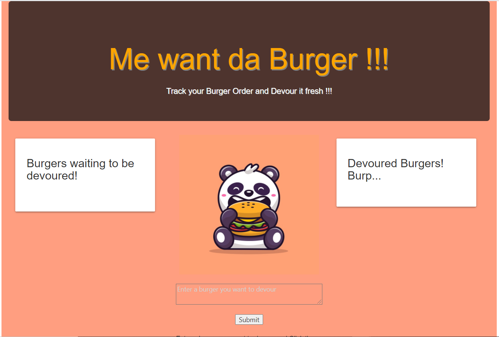
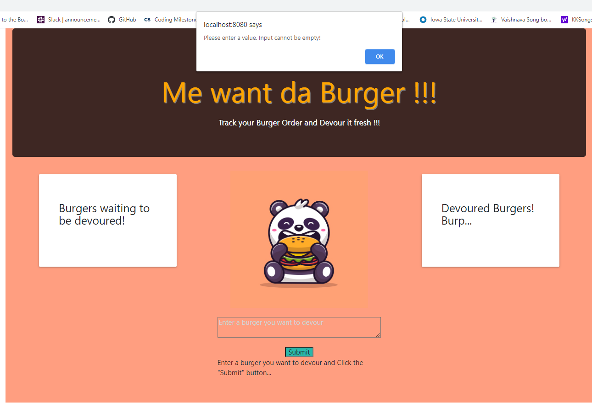
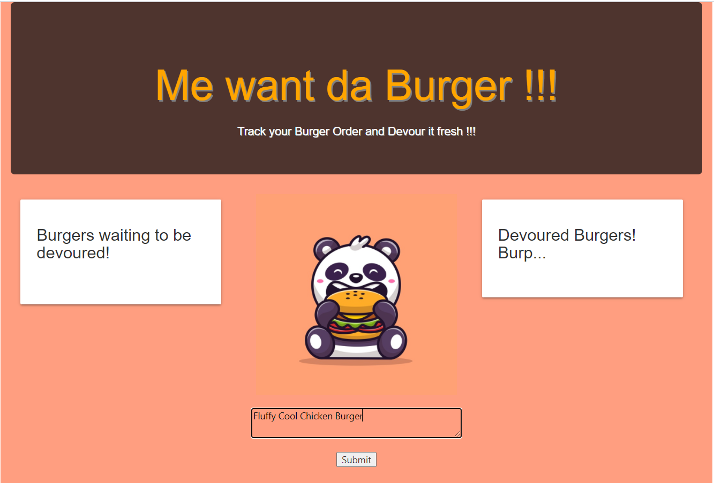
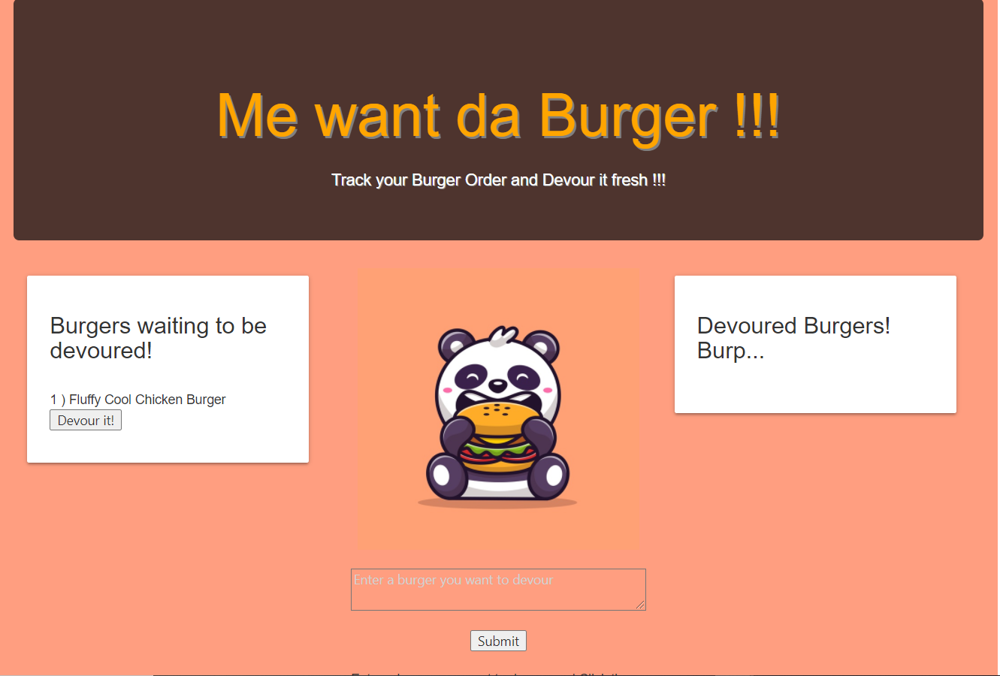
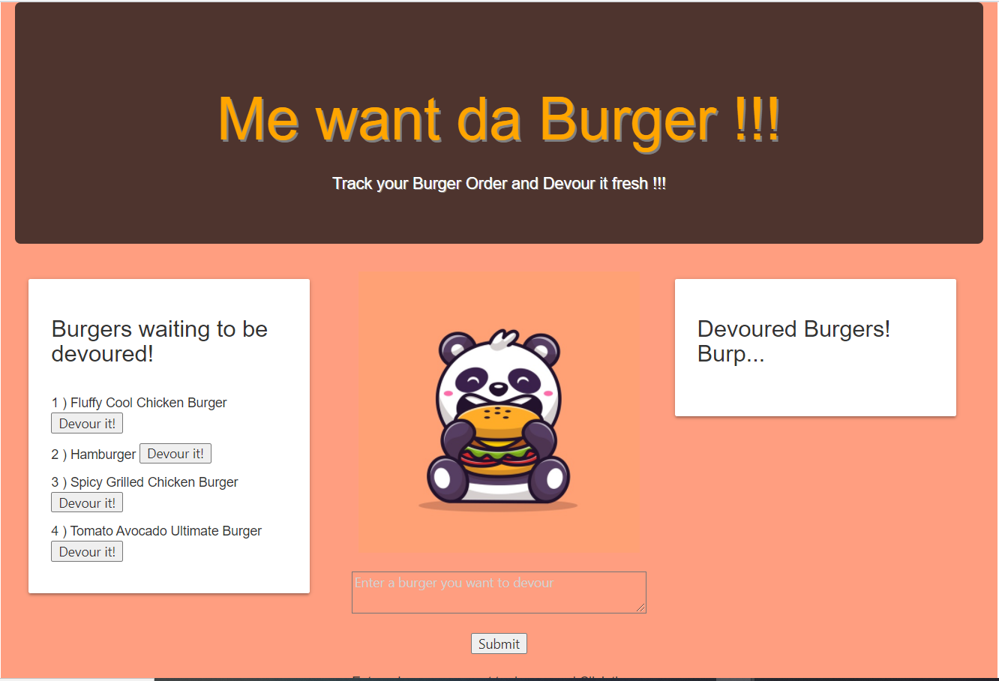
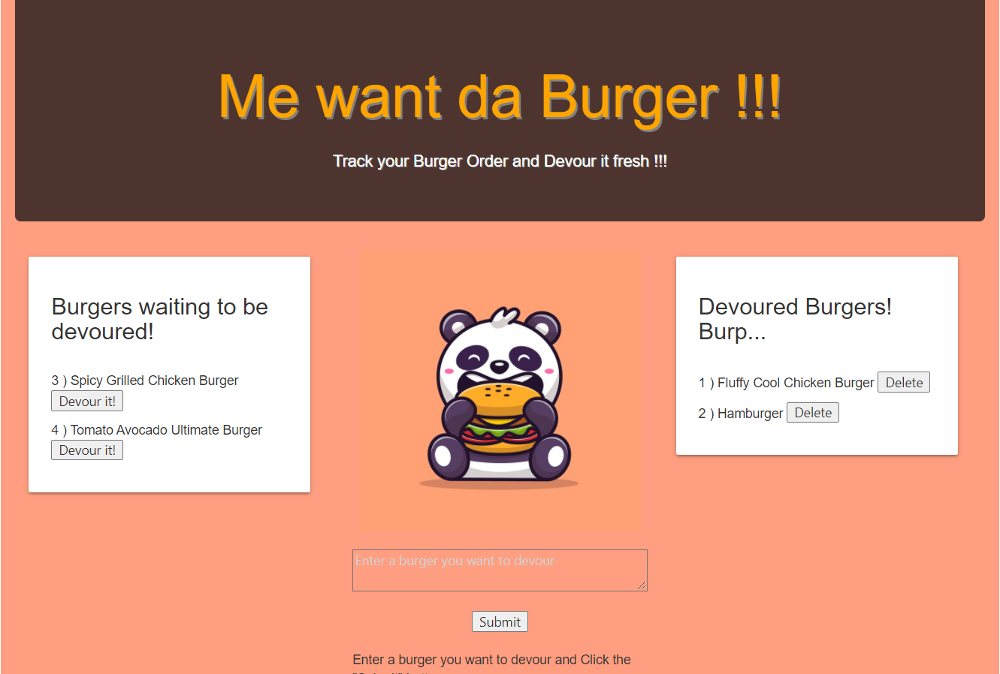
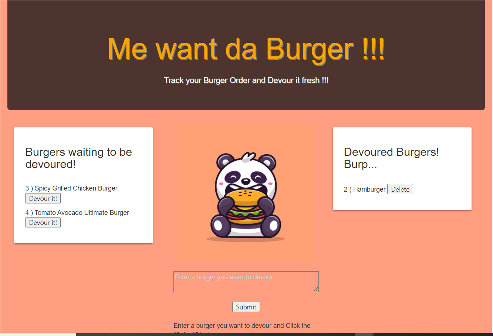

# Me want da Burger!

## Table of contents

1. [Description](#description)

2. [Install Guide](#install)

3. [Usage](#usage)

4. [Credits](#credits)

5. [screenshots](#screenshots)

6. [URL](#url)
        
<div id="description"/>
        
## Description
```
Men_want_da_Burger, is a restaurant app that lets users input the names of burgers they'r like to eat/devour.
```
        
<div id="install"/>
        
## Installation Instruction
```
* Node JS, mysql, express, express-handlebars. 
* This application uses nodeJS as runtime platform. 
* It uses mysql to persist the data in a database. 
* It uses express package/library to handle the AJAX requests and uses express-handlebars to have dynamic behavior in the front-end. 
* This is MVC (Model, View, Controller) application, where the application fuctionality is compartmentalized into these 3 categories, for the ease of maintanence and flexibility and scalability of the application.
```
        
<div id="usage"/>
        
## Usage
```
* Running this application will require a Node JS runtime platform and the libraries/modules/packages mentioned above. 
* The applicated is version controlled in github and is hosted in Heroku. 
* The initial load of the page will display two list of burgers, a list of burgers waiting to be devoured and a list already devoured and has option to be deleted. 
* There is also option for user to enter a burger name to the textarea and click on the submit button to add it to the devour list. 
* Each burger in the waiting area also has a 'Devour it!' button. When the user clicks it, the burger will move to the right side of the page to the Devoured list. 
* There is also option for the user to delete burger in the devloured list, if need be.
```

<div id="credits"/>
        
## Credits
```
* Panda Image - https://image.freepik.com/free-vector/cute-panda-eating-burger-cartoon-vector-illustration-animal-food-concept-isolated-vector-flat-cartoon-style_138676-1936.jpg
* StackOverflow
* Google FU
```       
       
<div id="screenshots"/>
        
## Screenshots

<ins>Initial Page Load Screenshot:</ins>



<ins>Alert when Input field is Empty:</ins>



<ins>Adding New Burger in the Input field:</ins>



<ins>NewBurger Added to the Devoured List:</ins>



<ins>More Burgers Added:</ins>



<ins>Showing few devoured Burgers:</ins>



<ins>Burger(s) deleted from Devoured list:</ins>



      
      
<div id="url"/>
        
## URL:

GitHub Repository: https://github.com/meenaambalam/Me_want_da_Burger

Heroku application URL: https://me-want-da-burger.herokuapp.com/

Video Demo of the App: https://youtu.be/RUHA69BKOGc

Please contact meenaambalam at [meena.a.ambalam@gmail.com](mailto:meena.a.ambalam@gmail.com?subject=Github) in case of any questions with the application or instruction.